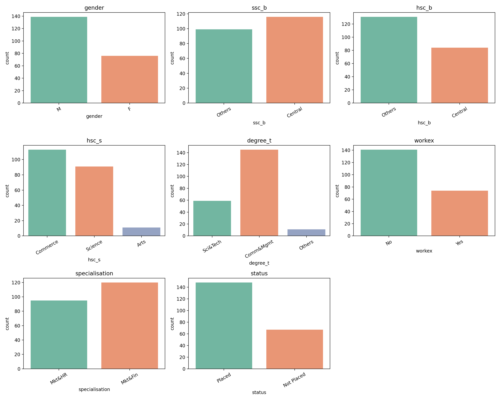
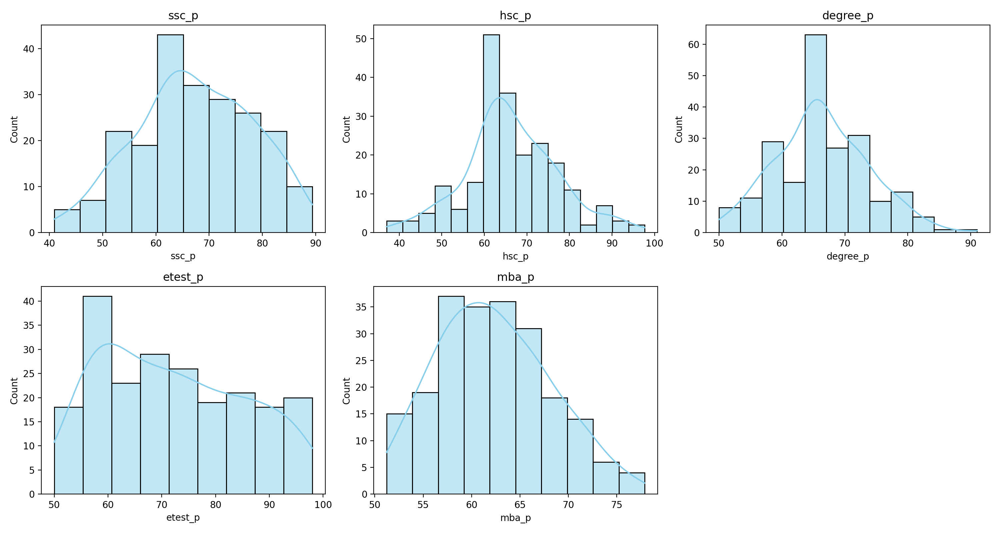
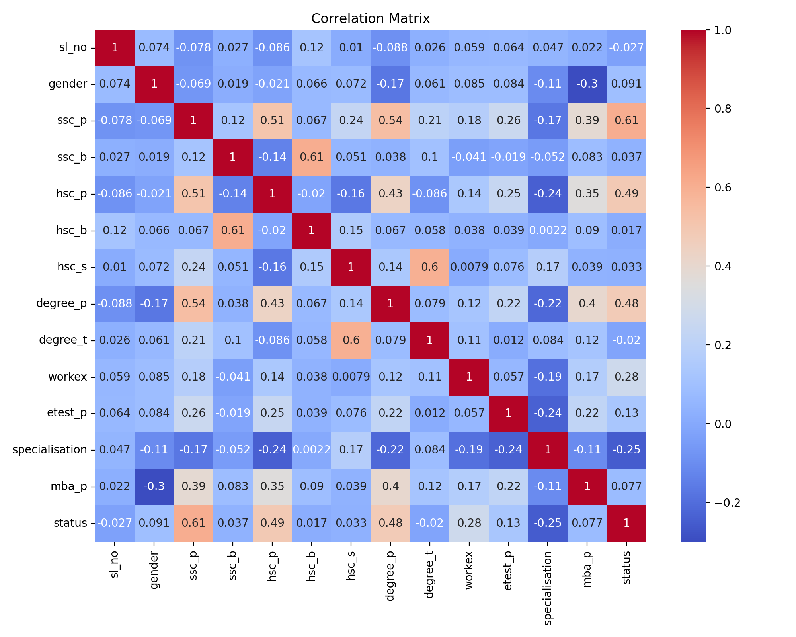
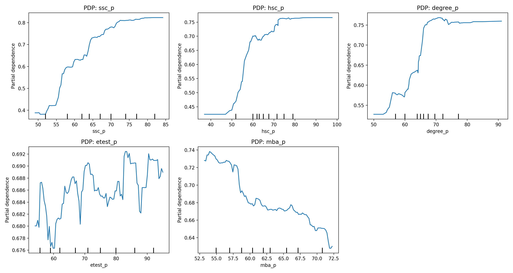
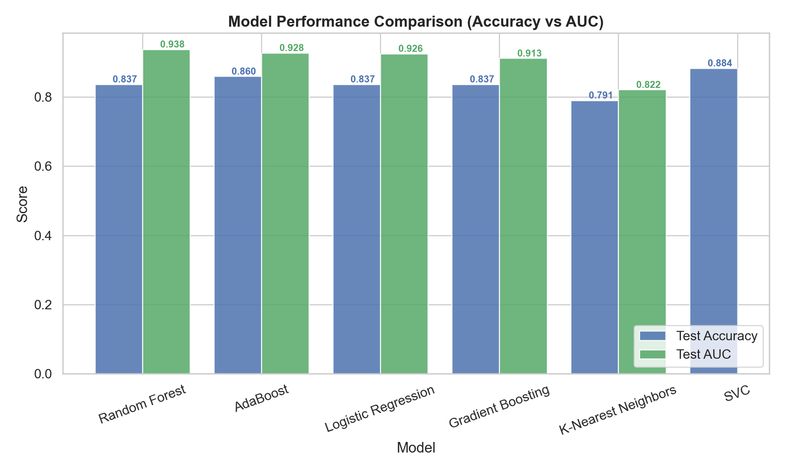
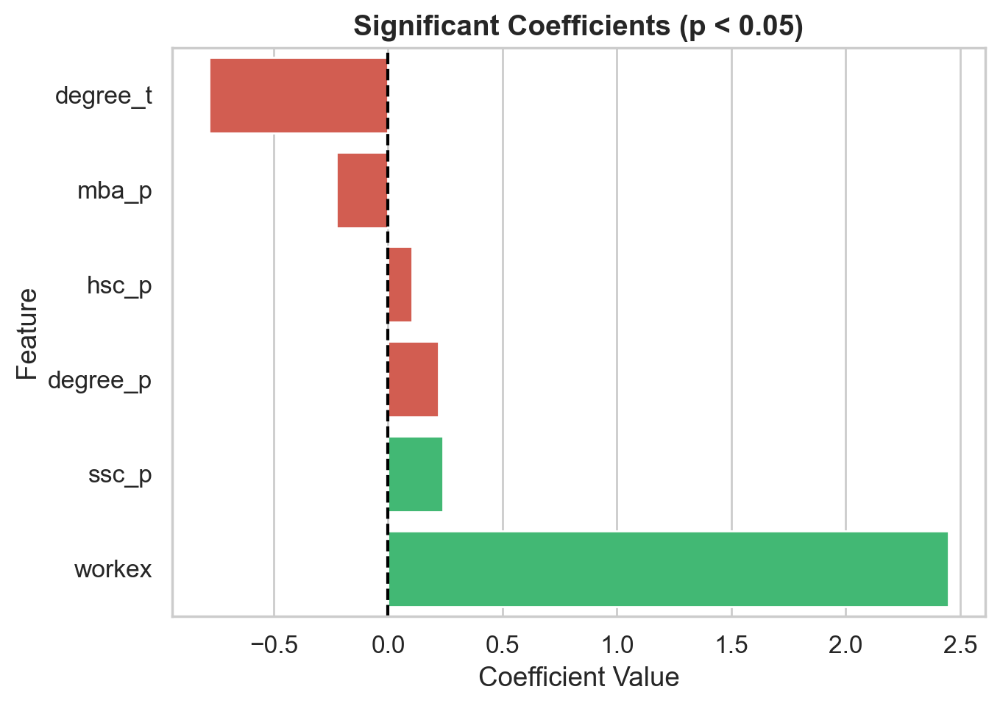

# Campus Recruitment Analysis & Visualization

This project analyzes and visualizes factors influencing campus recruitment success among students using data mining and machine learning.
Through extensive exploratory data analysis (EDA) and model interpretability using Logistic Regression and Random Forest, it identifies the most significant predictors of student placement outcomes.


---

## Technologies Used

**Python**, **Pandas**, **Matplotlib**, **Seaborn**, **Scikit-learn**, **NumPy**

---
## 📂 Project Structure
```
├── CAMRECRUIT_Anal_Visualization.ipynb   # Main notebook (EDA + Model + Visualization)
├── graphfolder/                           # Saved plots (categorical & numerical distribution, coefficients)
└── README.md                              # Project documentation
```
---
## 🚀 How to Run
### Clone the repository
```
git clone https://github.com/daewook1004/CampusRecruit_Analysis.git
cd Cam_recruit_anal
```
### Install dependencies
```
pip install numpy pandas matplotlib seaborn scikit-learn scipy kagglehub
```

### Run the notebook
```
jupyter notebook CAMRECRUIT_Anal_Visualization.ipynb
```
---
## 🧩 Problem Definition

The goal is to predict whether a student will be successfully placed in a company based on individual attributes such as academic performance, specialization, and work experience.
> **Campus Placement**:
> A hiring system where companies visit universities to recruit students before graduation, common in India and other Asian countries.

Dataset Overview:
- **Records:** 215 student entries
- **Attributes:** 15 features + 1 target (status)
- **Target Variable:** status — Placed or Not Placed
- **Note:** Salary data exists only for placed students and was excluded from training.

---
## 📊 Exploratory Data Analysis (EDA)
### Categorical Variables Distribution

Visualized the proportion of categorical features such as gender, educational board, specialization, and work experience to understand dataset composition.

<p align="left">  </p>


Insights

- Commerce and Science majors dominate, while Arts is underrepresented.
- Most students have no prior work experience, though those who do tend to have higher placement rates.
- Specialization in Marketing & Finance is slightly more common than Marketing & HR.
- Majority of records are Placed, suggesting successful campus recruitment outcomes overall.

### Numerical Variables Distribution

Examined continuous attributes such as ssc_p, hsc_p, degree_p, etest_p, and mba_p.
<p align="left">  </p>

Insights

- Most scores cluster between 50–80%, indicating generally average-to-good academic performance.
- Employment test scores (etest_p) show a wide range, suggesting differences in test difficulty or preparation.

### Correlation & Feature Relationships

Correlation analysis was conducted to detect associations among academic and employability factors.
<p align="left">  </p>

Findings

- Strong positive correlations among academic grades: ssc_p, hsc_p, and degree_p.
- Moderate positive relationship between etest_p and placement success.
- mba_p shows a negative correlation with placement status, implying that higher MBA scores might not guarantee better employability outcomes

### Pairplot of Top 5 Important Features

Using a Random Forest Classifier, we extracted the Top 5 most important features and visualized their pairwise relationships.
This helps reveal how key variables interact across different placement outcomes.
> 'workex', 'ssc_p', 'degree_p', 'mba_p', 'hsc_p'
<p align="center">  </p>

Insights

- Placed students tend to cluster around higher academic scores in ssc_p, degree_p, and hsc_p.
- workex clearly separates the groups, indicating prior experience as a major differentiator.
- A weak or inverse trend is visible between mba_p and placement, consistent with later model interpretation.


### Monotonicity & PDP (Partial Dependence)
To verify directional influence, monotonicity checks using Spearman correlation and Partial Dependence Plots were performed.
<p align="left">  </p>

Observations
- ssc_p, hsc_p, and degree_p display clear monotonic increases with placement probability.
- etest_p acts as a supporting variable—important but not dominant.
- Interestingly, mba_p shows an inverse pattern where high-scoring MBA students were less likely to be placed, potentially reflecting employer preference for balanced profiles over high academic achievers

### Summary of EDA
- **Academic performance** (secondary → higher → degree) remains the most consistent predictor of placement success.
- **Work experience** positively contributes to employability outcomes
- **MBA performance** introduces a unique reverse effect that warrants deeper domain-level interpretation
- Interestingly, mba_p shows an inverse pattern where high-scoring MBA students were less likely to be placed, potentially reflecting employer preference for balanced profiles over high academic achievers
---
## ⚙️ Model Evaluation

We evaluated five machine learning models using cross-validation and test set performance metrics, focusing on both accuracy and AUC scores.

<p align="left">  </p>

| Model               | CV Accuracy |   CV AUC   | Test Accuracy |  Test AUC  |
| :------------------ | :---------: | :--------: | :-----------: | :--------: |
| Logistic Regression |    0.8657   | **0.9314** |     0.8372    | **0.9256** |
| Random Forest       |    0.8373   |   0.9214   |     0.8372    | **0.9385** |
| AdaBoost            |    0.8435   |   0.9128   |   **0.8605**  |   0.9282   |
| Gradient Boosting   |    0.8487   |   0.8972   |     0.8372    |   0.9128   |
| SVC                 |    0.8542   |   0.9205   |   **0.8837**  |     N/A    |
| K-Nearest Neighbors |    0.8314   |   0.8955   |     0.7907    |   0.8218   |


Observations

- Logistic Regression achieved the highest mean CV AUC (0.9314), indicating strong generalization and class separability.

- Random Forest showed slightly lower accuracy but the best test AUC (0.9385), confirming its robustness against noise.

- SVC reached the highest single test accuracy but lacked AUC computation due to decision function configuration.

- Overall, Logistic Regression provided the best balance of interpretability and performance.
 
### 📉 Logistic Regression Coefficient-Based Analysis

The logistic regression coefficients highlight the direction and magnitude of each feature’s influence on placement probability.

<p align="left"> 

| Feature      | Coefficient | P-value | Interpretation                                                                                                      |
| :----------- | :---------: | :-----: | :------------------------------------------------------------------------------------------------------------------ |
| **workex**   |   +2.4479   | 6.6e-04 | Strong positive predictor — prior work experience significantly increases placement probability.                    |
| **ssc_p**    |   +0.2409   | 7.7e-07 | Higher secondary school performance correlates positively with placement.                                           |
| **degree_p** |   +0.2195   | 3.6e-04 | Undergraduate performance remains a key determinant of employability.                                               |
| **hsc_p**    |   +0.1034   | 4.4e-03 | Modest but significant positive effect of higher secondary marks.                                                   |
| **mba_p**    |   −0.2268   | 1.2e-04 | Unexpected **negative coefficient** suggests overqualification or mismatch effects among high-scoring MBA students. |
| **degree_t** |   −0.7827   | 2.8e-02 | Students from *Technical* degrees show slightly lower placement odds than *Commerce/Management* majors.             |

### Summary of Findings

- Work experience is the strongest individual predictor of successful placement.

- Academic consistency across SSC–HSC–Degree levels is a positive signal for recruiters.

- MBA scores show an inverse relationship, possibly due to overqualification bias.

- The analysis aligns with SHAP and PDP interpretations, reinforcing that early academic performance and prior experience are decisive in employability outcomes.
---
## 💬 Discussion and Conclusion
The results highlight distinct patterns influencing campus placement outcomes.

### 🔹 Key Findings
- Work experience emerged as the strongest individual predictor of successful placement.

- Academic consistency across SSC–HSC–Degree levels showed a strong positive signal for recruiters.

- MBA performance revealed an inverse relationship with placement probability, suggesting that exceptionally high academic achievement at the MBA level does not necessarily translate into employability advantages.

- These findings align with Partial Dependence Plot (PDP) analysis, reinforcing that early academic performance and prior work experience are more decisive factors than postgraduate scores.

### ⚠️ Why Are High MBA Scores Disadvantageous?

This counterintuitive outcome may reflect the “overqualification bias.”
In real-world hiring, recruiters may avoid candidates perceived as overly specialized or academically elite if they fear poor job fit, cultural misalignment, or retention issues.

Possible Causes
- 🧠 Overqualification effect — Top MBA performers often also have high undergraduate scores, making them appear “too advanced” for entry-level corporate roles.
- 💼 Intentional avoidance by employers — Companies may perceive these candidates as less likely to remain in the position or accept standard compensation.
- 📊 Dataset limitation — Since company tier or salary data were unavailable, the model could not explicitly capture employer-side selectivity.
Future studies incorporating company rank or salary level could clarify whether MBA overperformance leads to selective rejection or higher-tier placement.


